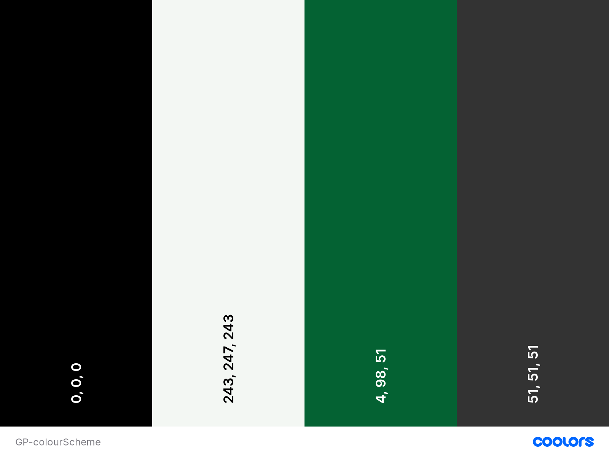

# GuledPay

## UX (User Experience) 
---
### Project Goals 
* To build a money transfer app that allow user to make international transfers back home to their families and friends. 

### User Goals
* To send funds to family and friends at little cost in no time.
* To be able to send funds directly receiver's bank accounts, mobile or cash in hand.

### Company's Goals
* To make the service to be at least 10 times cheaper and faster for the user compared to biggest competitors like WesternUnion.

### User Stories
* As a **user**, I want the service to be **much cheaper** and **faster** than the currently available services.
* As a **user**, I want the app to be **easy to use** and **easy to learn to use** - it requires **only three clicks or taps** to make an action.
* As a **user**, I want the transfer to be 100% secure and the receiver is guaranteed they will receive it.

### User Requirements and Expectations
**Requirements**
* Should be a one page website where each relevant container is display when required and the previous/other containers are hidden. 
* Should have a loading animation when requesting data, processing payment or transfer
* Should have good performance and work with little lag since this app is supposed to be faster than the competitors'.

**Expectations**
* Clean and minimalist design to make it as easy as possible for the user to use and identify features.

### Design Choices 
---
**Fonts**

I went [Roboto](https://fonts.google.com/specimen/Roboto?sort=popularity) because I was looking for a simple and clean font that displayed simplicity and professionalism.

**Colours**

I chose to use the [Coolors](https://coolors.co/) colour scheme generator to find one suitable for this project. Below is a screenshot of the colour scheme. They are colours that are pleasant to look at.

